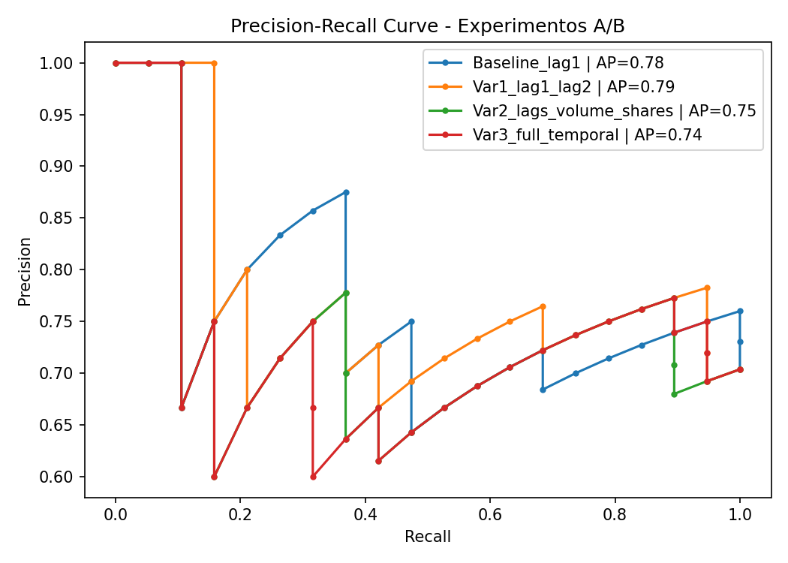
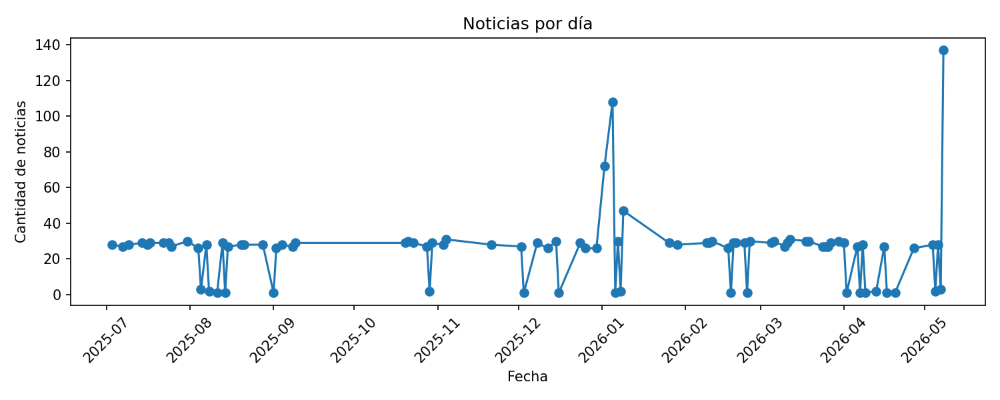
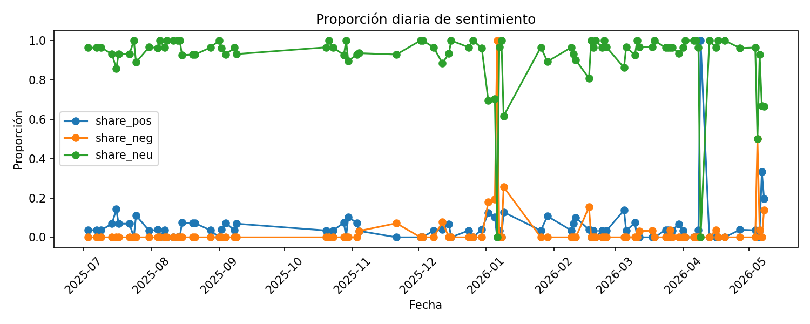
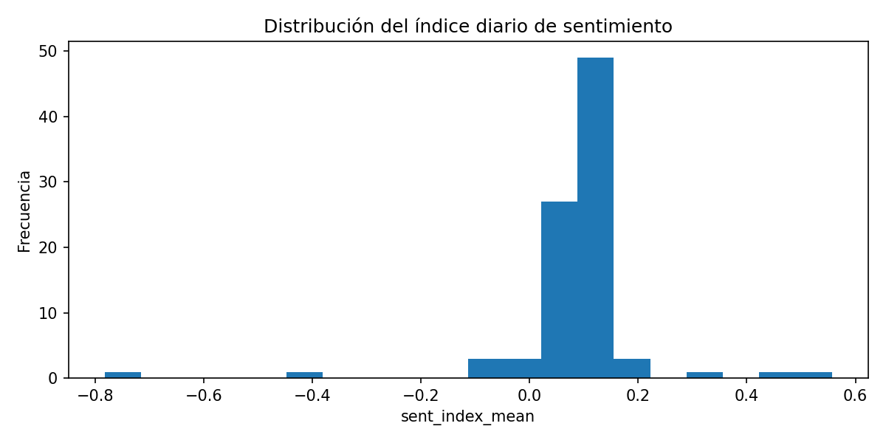
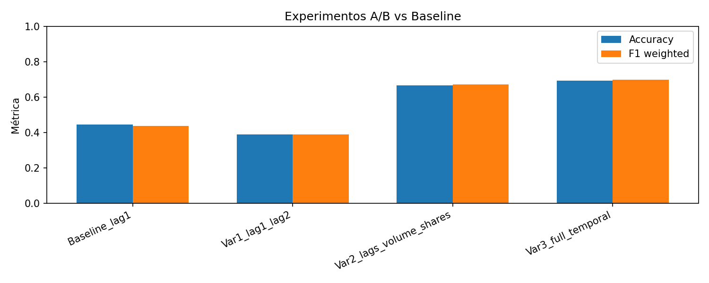
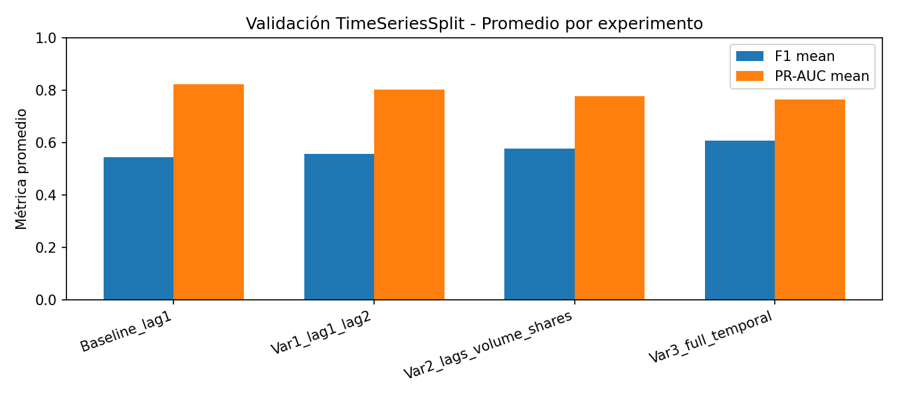
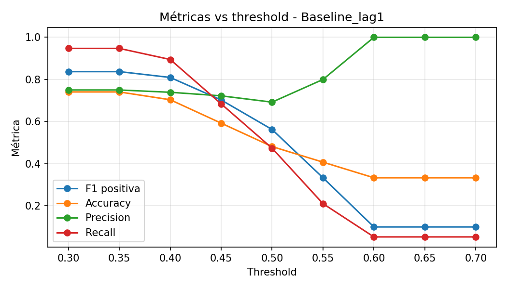

# 📈 Análisis de sentimiento en noticias macroeconómicas para la generación de señales sobre USD/PEN mediante Inteligencia Artificial


---

# 📌 Descripción General

Este proyecto implementa un pipeline end-to-end de NLP financiero para analizar noticias macroeconómicas y generar señales preliminares asociadas al comportamiento del tipo de cambio USD/PEN.

El sistema integra:

- RSS
- scraping histórico
- análisis de sentimiento
- Embeddings + FAISS
- agregación temporal
- modelos baseline de Machine Learning
- comparación contra USD/PEN real

El objetivo es construir indicadores cuantitativos de sentimiento que puedan servir como apoyo analítico para decisiones relacionadas con Tesorería y mercados financieros.

---

# 🎯 Objetivos

✅ Automatizar la ingesta de noticias financieras  
✅ Analizar sentimiento en español e inglés  
✅ Construir indicadores diarios de sentimiento  
✅ Comparar sentimiento vs dirección USD/PEN  
✅ Generar señales explicables  
✅ Evaluar desempeño preliminar mediante modelos baseline

---

# 🧠 Arquitectura del Sistema

<p align="center">
  
</p>

---

# ⚙️ Tecnologías Utilizadas

| Tecnología | Uso |
|---|---|
| Python | Lenguaje principal |
| Transformers | Modelos NLP |
| FinBERT | Sentimiento financiero EN |
| RoBERTuito | Sentimiento ES |
| FAISS | Recuperación semántica |
| Pandas | Procesamiento de datos |
| Matplotlib | Visualización |
| Scikit-learn | Baselines ML |
| SQLite | Persistencia local |
| GDELT | Ingesta histórica |

---

# 📰 Fuentes de Noticias

## 🌎 Fuentes en inglés

- Reuters Business
- Yahoo Finance
- CNBC Markets
- Financial Times
- MarketWatch
- GDELT Historical News

## 🇵🇪 Fuentes en español

- Gestión
- El Comercio
- Bloomberg Línea
- América Economía

---

# 📊 Dataset Generado

El pipeline genera automáticamente:

| Archivo | Descripción |
|---|---|
| `news_raw.csv` | Noticias originales |
| `news_clean.csv` | Noticias limpias |
| `news_scores.csv` | Sentimiento por noticia |
| `daily_sentiment.csv` | Indicadores diarios agregados |
| `compare_sentiment_vs_fx.csv` | Comparación sentimiento vs USD/PEN |
| `daily_evaluation_table.csv` | Evaluación diaria |
| `brief_YYYY-MM-DD.md` | Brief automático |

---

# 🔄 Etapas del Pipeline

# 🔄 Etapas del Pipeline

## 1. Ingesta de noticias

Fuentes utilizadas:

- RSS
- Reuters scraping
- Bloomberg Línea scraping
- GDELT histórico

---

## 2. Limpieza y normalización

Procesos:

- eliminación de HTML
- normalización Unicode
- filtrado de ruido
- deduplicación

---

## 3. Detección de idioma

Enrutamiento automático:

- Español → RoBERTuito
- Inglés → FinBERT

---

## 4. Embeddings + FAISS

Modelo utilizado:

- `intfloat/multilingual-e5-base`

Aplicaciones:

- recuperación semántica
- soporte RAG
- búsqueda contextual

---

## 5. Análisis de sentimiento

### Modelos utilizados

| Idioma | Modelo |
|---|---|
| EN | `ProsusAI/finbert` |
| ES | `pysentimiento/robertuito-sentiment-analysis` |

Etiquetas generadas:

- positive
- neutral
- negative

---

## 6. Agregación diaria

Se generan:

- promedio de sentimiento
- proporción positiva
- proporción negativa
- proporción neutral
- volumen de noticias
- indicadores temporales

---

## 7. Feature engineering temporal

Se construyen variables predictivas usando información presente o pasada.

| Feature | Descripción |
|---|---|
| `sent_index_mean` | índice promedio de sentimiento del día |
| `sent_index_strength` | intensidad del sentimiento diario |
| `share_pos` | proporción de noticias positivas |
| `share_neg` | proporción de noticias negativas |
| `share_neu` | proporción de noticias neutrales |
| `n_news_total` | volumen total de noticias |
| `lag_sent_1` | sentimiento del día anterior |
| `lag_sent_2` | sentimiento de hace 2 días |
| `lag_sent_3` | sentimiento de hace 3 días |
| `rolling_sent_3` | promedio móvil de sentimiento de 3 días |
| `rolling_sent_5` | promedio móvil de sentimiento de 5 días |
| `volatility_sent_3` | volatilidad del sentimiento de 3 días |
| `volatility_sent_5` | volatilidad del sentimiento de 5 días |
| `lag_news_1` | volumen de noticias del día anterior |

---

# 🛡️ Control de Leakage Temporal

Las features predictivas usan información pasada mediante `shift()` y ventanas móviles (`rolling`) para evitar leakage temporal.

Esto significa que el modelo no utiliza información futura para predecir la dirección del USD/PEN.

Ejemplo:

```text
Para predecir el movimiento de hoy, se usa el sentimiento de días anteriores.
```

La validación también respeta el orden cronológico:

```text
Train = pasado
Test  = futuro
```

---

# 📊 Resultados Obtenidos

## 📌 Split temporal utilizado

```text
Train: 2025-07-09 → 2026-03-06 | filas: 84
Test : 2026-03-07 → 2026-05-08 | filas: 36
```

---

## 📈 Métricas Baseline

| Modelo | Accuracy | F1 Weighted | F1 Binary |
|---|---:|---:|---:|
| Dummy most_frequent | 0.25 | 0.10 | 0.00 |
| Rule sentiment | 0.96 | 0.92 | 1.00 |
| Logistic baseline | 0.50 | 0.50 | 0.67 |

---

## 📈 Resultados de Experimentos A/B

| Experimento | Accuracy | F1 Weighted | F1 Binary |
|---|---:|---:|---:|
| Baseline_lag1 | 0.50 | 0.50 | 0.67 |
| Var1_lag1_lag2 | 0.50 | 0.50 | 0.67 |
| Var2_lags_volume_shares | 0.75 | 0.64 | 0.86 |
| Var3_full_temporal | 0.75 | 0.64 | 0.86 |

---

# 🧪 Experimentos A/B

Los experimentos A/B comparan variantes incrementales usando el mismo dataset, misma seed y mismo split temporal.

| Experimento | Cambio principal |
|---|---|
| `Baseline_lag1` | usa solo `lag_sent_1` |
| `Var1_lag1_lag2` | agrega `lag_sent_2` |
| `Var2_lags_volume_shares` | agrega volumen de noticias y proporciones de sentimiento |
| `Var3_full_temporal` | agrega rolling y volatilidad temporal |

---

# 📈 Validación Reforzada

Además del holdout temporal, se implementó `TimeSeriesSplit` para evaluar el desempeño en múltiples cortes temporales.

Algunos folds iniciales pueden ser omitidos cuando el conjunto de entrenamiento contiene una sola clase. Esto evidencia desbalance temporal del target y refuerza la necesidad de usar métricas como F1 y PR-AUC.

---

# 📉 Curva Precision-Recall

Se utiliza PR Curve debido al desbalance del target (`UP` vs `DOWN`).

Esta curva permite evaluar mejor el rendimiento del modelo cuando una clase aparece con mayor frecuencia que otra.

<p align="center">
  
</p>

---

# 📊 Figuras Generadas

## Noticias por día

<p align="center">
  
</p>

## Proporción diaria de sentimiento

<p align="center">
  
</p>

## Distribución del índice diario de sentimiento

<p align="center">
  
</p>

## Comparación A/B

<p align="center">
  
</p>

## Validación TimeSeriesSplit

<p align="center">
  
</p>

## Calibración de threshold

<p align="center">
  
</p>

---

# 📌 Interpretación Inicial

Los resultados preliminares sugieren que:

- el sentimiento financiero contiene información útil para anticipar movimientos del USD/PEN
- incorporar volumen y composición del sentimiento mejora el desempeño
- las variables temporales aportan señal predictiva inicial
- el dataset ya permite validaciones temporales iniciales más consistentes
- aún se requiere ampliar cobertura histórica para validación robusta

---

# 📈 Exploratory Data Analysis (EDA)

El repositorio incluye:

```text
notebooks/eda_sentiment_week5.ipynb
```

El notebook contiene:

✅ estadísticas descriptivas  
✅ análisis temporal  
✅ distribución de sentimiento  
✅ comparación contra USD/PEN  
✅ modelos baseline  
✅ experimentos A/B  
✅ PR Curve  
✅ TimeSeriesSplit  
✅ calibración de threshold  
✅ métricas, gráficos y logs  

---

# 📋 Logs y Reproducibilidad

Los resultados se guardan en:

```text
logs/
figs/
```

Archivos principales:

| Archivo | Descripción |
|---|---|
| `logs/data_version_week5.json` | snapshot de datos |
| `logs/metrics_baseline_week5.csv` | métricas baseline |
| `logs/metrics_experimentos_week5.csv` | resultados A/B |
| `logs/timeseries_cv_folds_week5.csv` | folds de TimeSeriesSplit |
| `logs/timeseries_cv_summary_week5.csv` | resumen CV temporal |
| `logs/threshold_tuning_week5.csv` | calibración de umbral |
| `logs/experiment_decision_week5.csv` | decisión experimental |
| `logs/week5_experiment_summary.txt` | resumen textual del experimento |

---

# ✅ Decisión Experimental

La variante con mejor desempeño preliminar fue:

```text
Var2_lags_volume_shares
```

Esta variante mejora frente al baseline al incorporar:

- sentimiento rezagado
- volumen de noticias
- proporciones positivas, negativas y neutrales

La variante `Var3_full_temporal` también mejora, pero no presenta una ganancia adicional clara respecto a `Var2`, por lo que `Var2` se considera una alternativa más simple y eficiente.

---

# ⚠️ Limitaciones Actuales

- las fuentes RSS no garantizan continuidad histórica completa
- el scraping histórico depende de fuentes públicas
- existe predominancia de noticias neutrales
- el target puede estar desbalanceado temporalmente
- algunos folds pueden contener una sola clase
- señales aún experimentales
- resultados preliminares de carácter académico

---

# 🚀 Mejoras Futuras

- ampliar cobertura histórica
- incorporar más fuentes macroeconómicas
- añadir indicadores como tasas, inflación, commodities y DXY
- backtesting financiero
- modelos avanzados
- LSTM / Transformers temporales
- dashboard interactivo
- pipeline en tiempo real

---

# 📂 Estructura del Proyecto

```text
news-sentiment-pipeline/
├── configs/
├── data/
├── figs/
├── logs/
├── notebooks/
├── src/
├── scripts/
├── faiss_store/
├── run_pipeline.py
└── README.md
```

---

# ▶️ Instalación

## Clonar repositorio

```bash
git clone https://github.com/Thomyvq/news-sentiment-pipeline-usdpen.git
cd news-sentiment-pipeline-usdpen
```

---

## Instalar dependencias

```bash
pip install -r requirements.txt
```

---

# ▶️ Ejecución del Pipeline

Ejemplo:

```bash
python run_pipeline.py --start-date 2025-07-01 --end-date 2026-05-08
```

---

# ▶️ Ejecutar Notebook EDA / Week5

Abrir:

```text
notebooks/eda_sentiment_week5.ipynb
```

Luego:

```text
Restart Kernel → Run All
```

---

# 👨‍💻 Autor

## Thomy Jefferson Villanueva Quinteros

- Ingeniería de Sistemas – UNI
- MSc Artificial Intelligence
- Investigación en NLP Financiero y Tesorería

GitHub:

https://github.com/Thomyvq

---

