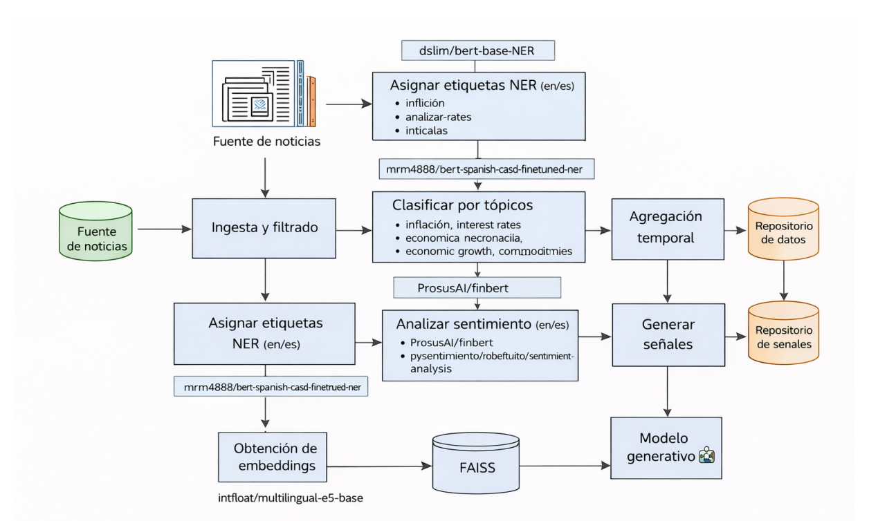

# 📈 Análisis de Sentimiento en Noticias Macroeconómicas Formales para la Generación de Señales de Apoyo a la Toma de Decisiones en Tesorería mediante Técnicas de Inteligencia Artificial


Sistema basado en Inteligencia Artificial para analizar noticias macroeconómicas formales y generar señales explicables de apoyo a decisiones de Tesorería relacionadas con el tipo de cambio USD/PEN.

---

## 📌 Descripción General

Este proyecto transforma noticias económicas en indicadores cuantitativos diarios utilizando:

- NLP financiero  
- Modelos de sentimiento  
- Embeddings semánticos  
- FAISS  
- RAG  

El objetivo es apoyar decisiones analíticas en Tesorería mediante señales interpretables.

---

## 🎯 Objetivos

✅ Automatizar noticias financieras  
✅ Analizar sentimiento ES/EN  
✅ Generar señales USD/PEN  
✅ Crear brief automático  
✅ Evaluar impacto preliminar

---

## ⚙️ Tecnologías

| Tecnología | Uso |
|-----------|-----|
| Python | Lenguaje principal |
| Transformers | NLP |
| FinBERT | Sentimiento EN |
| RoBERTuito | Sentimiento ES |
| FAISS | Recuperación semántica |
| Pandas | Datos |
| Matplotlib | Visualización |

---


## 🧠 Arquitectura del Sistema

# <p align="center">

# &#x20; 

# </p>

## 📂 Estructura del Proyecto

```text
news-sentiment-pipeline/
├── .gitignore
├── LICENSE
├── README.md
├── requirements.txt
├── run_pipeline.py
│
├── config/
│   └── config.yaml
│
├── data/
│   ├── raw/
│   ├── processed/
│   └── reports/
│
├── docs/
│   └── sprint1_roadmap.md
│
├── faiss_store/
│   ├── index.faiss
│   └── meta.jsonl
│
├── figs/
│   └── arquitectura_pipeline.png
│
├── notebooks/
│   └── eda.ipynb
│
├── scripts/
│   └── make_eda_plots.py
│
├── src/
│   ├── __init__.py
│   ├── pipeline.py
│   │
│   ├── db/
│   │   └── __init__.py
│   │
│   ├── eval/
│   │   └── __init__.py
│   │
│   ├── evaluation/
│   │   ├── __init__.py
│   │   └── compare_fx.py
│   │
│   ├── ingest/
│   │   ├── __init__.py
│   │   ├── rss.py
│   │   └── scraping.py
│   │
│   ├── market/
│   │   ├── __init__.py
│   │   └── usdpen_yahoo.py
│   │
│   ├── processing/
│   │   ├── __init__.py
│   │   ├── cleaning.py
│   │   ├── language.py
│   │   ├── ner.py
│   │   ├── topics.py
│   │   ├── sentiment.py
│   │   ├── standardize.py
│   │   └── aggregate.py
│   │
│   ├── rag/
│   │   ├── __init__.py
│   │   ├── embeddings.py
│   │   ├── indexer.py
│   │   ├── retriever.py
│   │   └── brief_generator.py
│   │
│   ├── signals/
│   │   ├── __init__.py
│   │   └── rules.py
│   │
│   └── utils/
│       ├── __init__.py
│       ├── config.py
│       ├── hashing.py
│       └── text.py
│
└── tools/
    └── export_news_scores.py
```

## ▶️ Ejecución

pip install -r requirements.txt
python run_pipeline.py

## 📊 Resultados Iniciales

- Pipeline funcional end-to-end
- Noticias procesadas automáticamente
- Señales diarias generadas
- Brief automático operativo
- Comparación inicial con USD/PEN

## 🗺️ Roadmap


## 👨‍💻 Autor

- Thomy Jefferson Villanueva Quinteros
   - Email: tvillanuevaq@uni.pe
   - GitHub: https://github.com/Thomyvq

